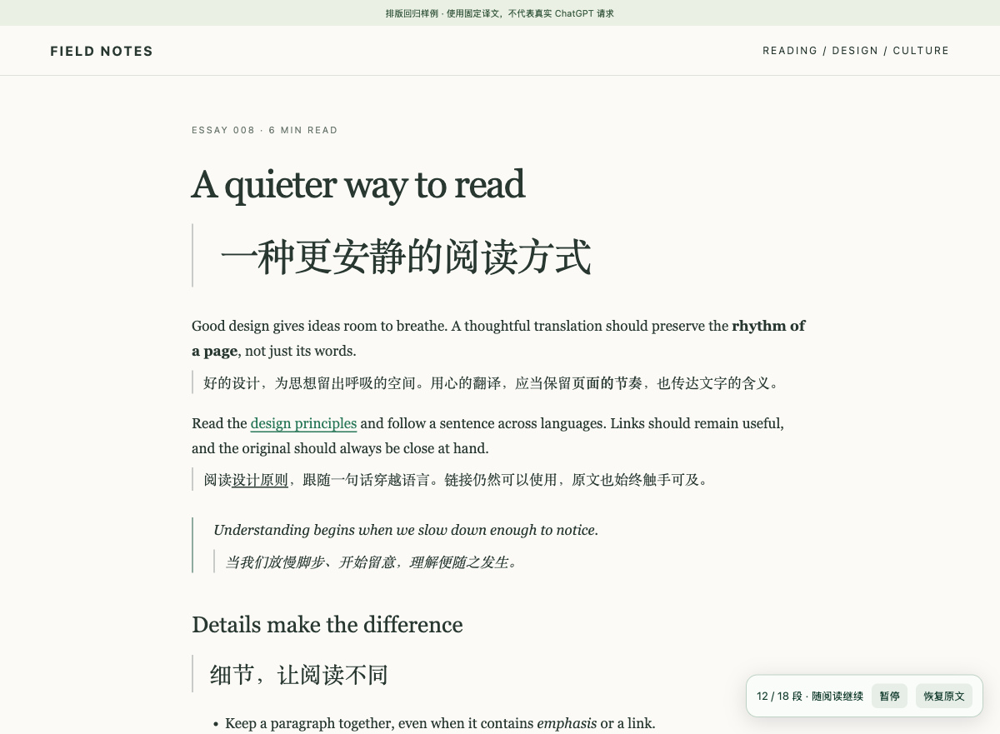

# Leaf Translate · 叶译

English · [简体中文](README.zh-CN.md)

A Manifest V3 browser extension for bilingual webpages, using **official Sign in with ChatGPT** and eligible ChatGPT plan usage. No API key is required. Each user signs in with their own account on their own device.

Open source under the [MIT License](LICENSE). This is a developer preview, **not a Chrome Web Store release**. Requires Node.js 22+ and Chrome 120+; Dia is also supported on macOS.

**[Download v0.2.0](https://github.com/ydotdog/leaf-translate/releases/tag/v0.2.0)** and choose the `leaf-translate-0.2.0.zip` attachment. GitHub’s automatic source archives do not include the built `dist` directory; build those from source first. The older v0.1.0 release does not contain the scrolling/navigation fixes or three-language UI.



## Install on macOS

1. Extract the complete `leaf-translate` folder. Install [Node.js 22 or newer](https://nodejs.org/) if needed.
2. Run `install-macos.command` for Chrome or `install-dia-macos.command` for Dia. Run each installer once if using both browsers. Review the scripts before running them; follow macOS security prompts without disabling system protections.
3. Open `chrome://extensions` (Dia displays `dia://extensions`), enable **Developer mode**, then **Load unpacked**. Press `⌘⇧G` in the folder chooser and enter `~/Library/Application Support/Leaf Translate/extension`. Select that installed directory.
4. Open Leaf Translate’s settings and choose **Continue with ChatGPT**. Complete sign-in and plan-usage consent on OpenAI’s official page.
5. Select an available model returned for your account. Open a regular webpage and click **Translate this page**.

`Alt + Shift + T` toggles translation and the original. A page context-menu entry is also available. Pin Leaf Translate through the browser’s extensions menu if desired.

Chrome and Dia share the local account records, while each browser stores its own translation preferences. Signing out disconnects that shared account. The fixed extension ID is `hkpccpakokoliiahjeifekgadoffdpac`. `extension-key.json` contains a **public** manifest key, not an authentication credential; keep it so the Native Messaging allowlist continues to match.

## Update and uninstall

To update, download the new release and run the installer for each browser you use. This updates both the extension and its local component. In each browser’s extension manager, click Leaf Translate’s **Reload**. Refresh an already-open webpage before starting translation again; the entire browser need not restart. Replacing only extension JavaScript does not update the native sign-in callback page.

To uninstall, sign out in Leaf Translate and, if needed, disconnect its authorization in [ChatGPT usage settings](https://chatgpt.com/settings/usage). Remove the extension from your browser, then run:

```sh
npm run uninstall:host                      # Chrome
npm run uninstall:host -- --browser dia     # Dia on macOS
npm run uninstall:host -- --browser all     # both on macOS
```

These commands remove only the selected browser’s host registration. They preserve the shared component, extension copy and account records for any other browser still using them. After removing both installations, you can manually delete the Leaf Translate data directory listed in the [privacy notice](docs/PRIVACY.md). Deleting local files does not itself revoke remote authorization.

## Interface languages

The app follows **Chrome’s UI language**, using `chrome.i18n.getUILanguage()`, not the webpage language or Accept-Language preferences. English, Simplified Chinese and Traditional Chinese are complete across the popup, options, onboarding, connection/error states, context menu, command description, page toolbar and local OAuth callback pages.

- `zh-Hans`, mainland China and Singapore use Simplified Chinese.
- `zh-Hant`, Taiwan, Hong Kong and Macau use Traditional Chinese. Explicit script takes precedence over region.
- Other languages fall back to English. Bare `zh` uses Simplified Chinese.

Reopen extension pages after changing browser language; context menus refresh on browser startup. **UI language never changes your translation target.** The initial target remains Simplified Chinese, and saved choices remain intact. Target-language names use their native names; model names come from OpenAI. OpenAI controls its own hosted sign-in pages. Local callback pages use the language of the browser that started sign-in. Terminal installers use English because they have no Chrome UI language context.

## ChatGPT account and usage conditions

Leaf Translate implements OpenAI’s [open-source, locally hosted ChatGPT plan-usage flow](https://developers.openai.com/siwc/token-sharing-open-source). A new user’s sign-in dynamically creates a registration bound to that user and workspace, with a stable local host identifier. No maintainer credentials or shared accounts are distributed. The app requests the plan-usage scope and uses the account’s available models.

**MIT licensing does not mean unlimited free inference or guaranteed account eligibility.** Availability, model access, usage limits and consent depend on the user’s account/workspace and OpenAI’s current rules. Limits pause translation and preserve the original. There is no automatic API-key or billed fallback. You can manage authorization and usage in ChatGPT settings.

Paid or remotely hosted integrations have separate [OpenAI commercial access requirements](https://developers.openai.com/siwc/request-client-id). The software license does not replace OpenAI’s service terms, confer official endorsement, or create a production OAuth client for a commercial service.

## Why a local component?

The official OSS sign-in flow uses a temporary loopback callback at `http://127.0.0.1:<random-port>/auth/callback`. Tokens must stay in protected local storage, outside browser storage. A Chrome extension cannot host that callback, so Leaf Translate uses a Node.js component over Native Messaging.

The browser starts it on demand; no terminal or Codex CLI is needed. The callback listener closes after completion, cancellation or a ten-minute timeout. There is no persistent HTTP translation proxy. The component communicates through standard input/output and sends page text directly to `https://api.openai.com/v1/responses`. It never returns tokens to the extension or webpage, reads existing ChatGPT/Codex credentials, or uses ChatGPT’s internal web APIs.

## Reading behavior and limits

Translations appear beside their source blocks without replacing original nodes. Links, emphasis, inline code, lists and table cells retain their structure. Shadow DOM isolates styles; dark pages, narrow layouts and right-to-left translated text are supported. Long text is split with formatting markers preserved and validated before display.

Only blocks near the reading position are translated. Newly appended content, recycled feed nodes and changed source text/links are reconciled during continuous updates. **Main content first** uses a visible `main`, a unique visible top-level `article`, or the page body when a feed contains multiple articles. **Entire page** includes content outside that reading scope.

Within an enabled tab, same-origin SPA routes, back/forward, refreshes and ordinary navigation continue translation. Pause survives same-origin navigation; resume sends queued text. Restore original, closing the tab or crossing origins ends automatic continuation. A different protocol, subdomain or port is a different origin. New tabs need an explicit translation action. No persistent website access is requested.

This uses general DOM heuristics, not a guarantee of compatibility with every website. Scanning is capped at about 3,000 blocks. Inputs, editable areas, hidden regions, navigation, code blocks, math and explicit translation opt-outs are skipped. Bare text in flex/grid containers is handled conservatively. PDFs, image OCR, subtitles, iframes, shadow DOM content and browser internal pages are not supported. There is no translation-only view.

## Privacy and permissions

Starting translation sends readable text near your viewport to OpenAI, including sensitive article or email content if present. The app does not determine whether readable text is sensitive. Password/input fields and editable drafts are skipped. See the bilingual [privacy notice](docs/PRIVACY.md) for storage locations, deletion and data flow.

Permissions remain `activeTab`, `scripting`, `storage`, `nativeMessaging` and `contextMenus`. No all-sites host permission, cookie permission, telemetry or third-party translation service is added. Tokens are stored locally with directory mode `0700` and file mode `0600`; **they are not encrypted with the OS keychain**. Translation caches are in page memory and clear on restore, refresh or navigation.

## Build and Linux

```sh
git clone https://github.com/ydotdog/leaf-translate.git
cd leaf-translate
npm ci
npm test                 # builds first, then runs regression tests
npm run build
npm run install:host
```

On Linux, load the installed `~/.config/leaf-translate/extension` directory in Chrome. Linux installation has not been tested on a real Linux desktop. Windows, Chromium and Edge do not currently have a validated installation workflow. On macOS, `npm run install:host -- --browser dia` registers Dia, and `--browser all` registers both browsers. The default is Chrome.

This is a JavaScript project with no independent TypeScript typecheck. Tests cover parsing, OAuth safeguards, native framing/storage, DOM preservation, dynamic translation/navigation, locale completeness and UI states. The build checks syntax and bundling.

## Verification status

See [localization and publication QA](docs/PUBLICATION-QA.md), [scroll/navigation evidence](docs/SCROLL-NAVIGATION-QA.md), [initial QA](docs/QA.md) and [references](docs/REFERENCES.md).

Real x.com public pages were exercised in an isolated browser with continuous scrolling and same-origin navigation, using **fixed local translation responses**. The guest login wall limited further loading; this does not prove logged-in infinite-feed behavior. Local fixtures cover repeated append/reuse, continuous updates, stop/resume and navigation. Three-language UI checks use isolated Chrome for Testing and simulated account responses, without changing the user’s browser language or spending plan allowance.

Real OAuth consent, live model translation quality and ChatGPT usage accounting have **not** been verified as part of this release. Installing or opening the UI is not proof of server-side account eligibility.
