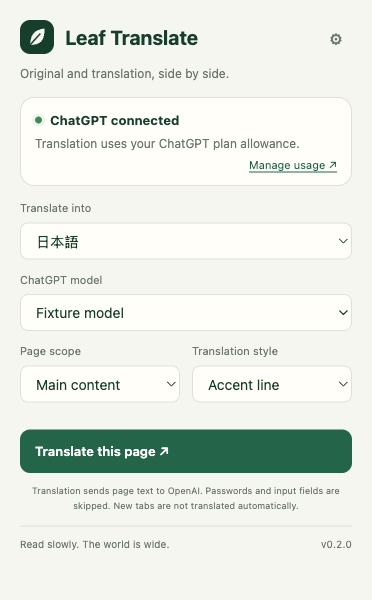
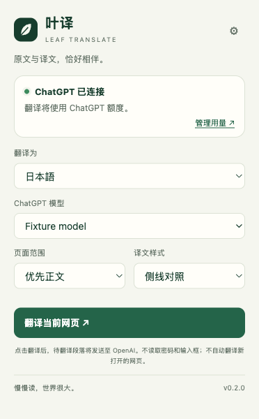
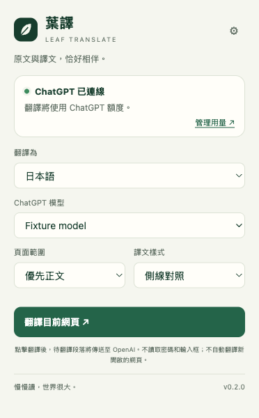

# Localization and publication QA — 2026-10-03

This report describes the v0.2.0 source and developer-preview build. It does not claim live ChatGPT model or OAuth eligibility verification.

## Scope and audit

Before publication, the repository was private. The remote contained `main`, `fix/dynamic-translation-navigation`, tag `v0.1.0`, and three reachable commits. `main` was an ancestor of the scrolling/navigation fix, so the default branch could be updated by fast-forward without rewriting history or removing branches/tags.

Reviewed all reachable file versions, commit metadata/messages, both release attachments (checksum and ZIP), and every distinct historical screenshot. Text scanning checked private-key markers, common provider/API tokens, JWT-shaped strings, credential filenames, account emails and personal absolute paths. Source/auth/storage code and release contents were also reviewed manually. The extension manifest key is a public RSA key. Test account strings are synthetic. Historical commit author attribution is retained as normal Git metadata; MIT copyright is unchanged.

GitHub metadata checks found zero issues, PRs, issue/commit comments, Actions runs/artifacts and deployments. Wiki, discussions and Pages were disabled. The old release description and attachments were reviewed. No credentials or sensitive private content were found. Historical screenshots contain local fixtures or public, signed-out X content; new screenshots contain simulated account/model states only. This is a scoped review and pattern scan, not a guarantee against every possible secret format. No user credential files were read for this audit.

## Implementation

- Shared catalogs contain 143 matching messages each for `en`, `zh-CN` and `zh-TW`.
- Chrome UI locale selects the application language. Explicit Chinese script wins over region; Taiwan/Hong Kong/Macau use Traditional Chinese, other Chinese variants use Simplified Chinese, and unsupported languages use English.
- Covers manifest name/description/action/command, popup, options, onboarding, account states, local errors, context menu, page toolbar and local OAuth success/failure pages.
- Native errors carry stable message keys; unknown raw upstream error text is not rendered. The browser's locale is passed to the local sign-in flow for callback rendering. Official OpenAI-hosted pages remain controlled by OpenAI.
- Target language is unchanged by UI locale. Language names remain native-language names, and model labels remain those supplied by OpenAI. Installers use English because they run outside Chrome.
- Existing scrolling/navigation behavior is retained. No new extension permissions, host permissions, production OAuth credentials or billing fallback were added.

## Automated checks

`npm test`: **60 passed, 0 failed** (build runs first). `npm run build` passed. `node --check` passed for all 19 JS/MJS files under `src`, `scripts`, and `tests`; `git diff --check` passed. There is no independent TypeScript typecheck in this JavaScript project.

Coverage includes all previous dynamic-content, infinite-append fixture, virtual-node reuse, continuous mutation, same-origin navigation, pause/resume and stop/re-enable regressions, plus:

- Locale normalization, English fallback, message-key and interpolation-placeholder completeness.
- Localized metadata and unchanged permission scope.
- Popup/options across three languages and five account/host states, with target language fixed to Japanese and no implicit settings writes.
- Onboarding, unknown-error sanitization and translated native errors.
- Context-menu refresh on install/startup and callback locale propagation.
- Page toolbar language through pause/resume.
- Success/failure callback templates in all three languages.

Logs: [tests](qa/localization/test-results.txt), [build](qa/localization/build-results.txt).

## Real-browser UI checks

Used an isolated Chrome for Testing profile on the user's Mac. No personal browser UI language was changed, no production installation was replaced, and no real account credentials or translation allowance were used. The actual unpacked v0.2.0 extension loaded successfully; the missing-native-host state rendered in English before adding test shims.

For locale/state combinations, Playwright supplied fixed `chrome.i18n.getUILanguage()` and account/model responses inside the test extension pages. This tests actual production HTML/JS/CSS rendering, not macOS/Chrome's system language-switch UI or real OAuth. Six callback pages were generated with the production callback renderer and opened as local test files.

| Check | Result |
| --- | --- |
| English / Simplified / Traditional popup, 372 × 600 | No horizontal overflow; main action bottom 473 / 484 / 484 px |
| Three-language options and first-use dialog | Localized, readable, no horizontal overflow |
| Signed out / pending / consent-and-error / missing host | Correct localized state and error/setup text |
| Unsupported `fr` UI language | English fallback |
| Saved translation target `ja` | Unchanged in every tested UI locale |
| Six local callback success/failure pages | Correct `lang`, heading/body and no horizontal overflow |

The first UI run exposed truncated English dropdown labels; the labels were shortened and the full matrix rerun successfully. A test-only wait for a native `<option>` to become visible was corrected to wait for the selected value.

Evidence: [UI results](qa/localization/i18n-ui-results.json), [callback results](qa/localization/i18n-callback-results.json), [Playwright UI script](qa/localization/ui-check.js).

| English | 简体中文 | 繁體中文 |
| --- | --- | --- |
|  |  |  |

Options, welcome dialogs and all callback screenshots are in the same evidence directory. They show synthetic `Fixture model` / account state and are not proof of successful OAuth authorization.

## Existing X evidence and remaining limits

The [scroll/navigation report](SCROLL-NAVIGATION-QA.md) records the prior real x.com check: signed-out public profile, successive downward scrolls, later visible posts and same-origin navigation, using fixed local translation responses. The visitor login wall limited the feed to five posts. Logged-in infinite feeds, real model output and ChatGPT quota accounting remain unverified. This localization change reran the automated scrolling/navigation regressions; it did not log into X or spend live translation allowance.

Linux installation is documented but not validated on a real Linux desktop. No Chrome Web Store release, commercial client registration or automatic update to the user's Chrome/Dia installation is part of this source-publication task.

## 简体中文摘要

公开前已审计所有远端分支、历史文件、旧发行附件和截图；未发现凭据或敏感私人内容。MIT 与正常 Git 作者信息保留，不强推、不删除分支。英/简/繁各 143 个语言键完整，60 项测试及构建通过。独立 Chrome 实际加载扩展，三语 UI 状态使用模拟响应检验；不会改变目标翻译语言，也没有更改个人浏览器语言或使用真实额度。真实 OAuth、模型翻译质量、额度核对及已登录 X 无限信息流仍不在已验证范围内。
